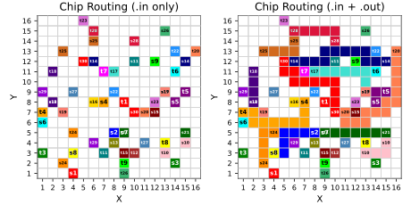
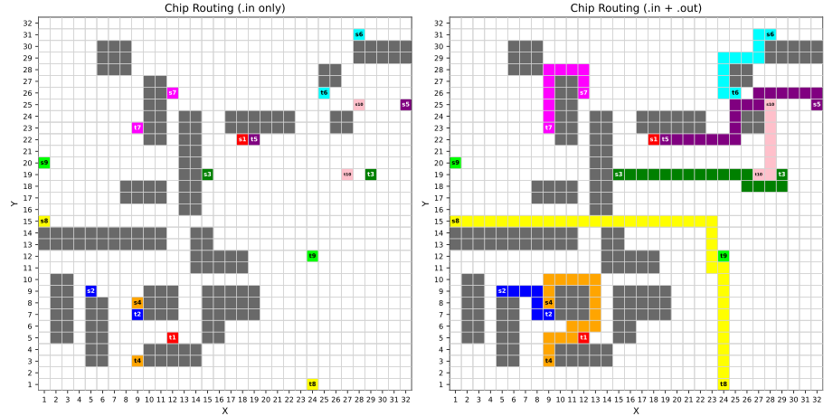
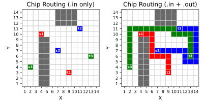
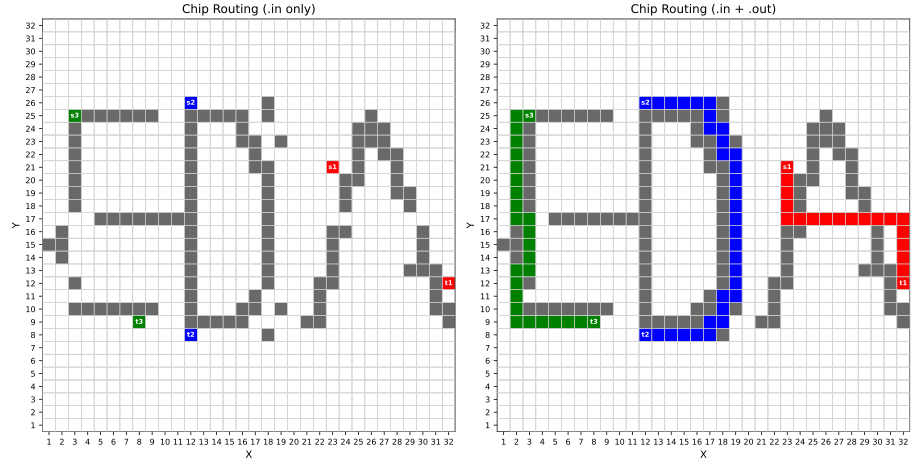
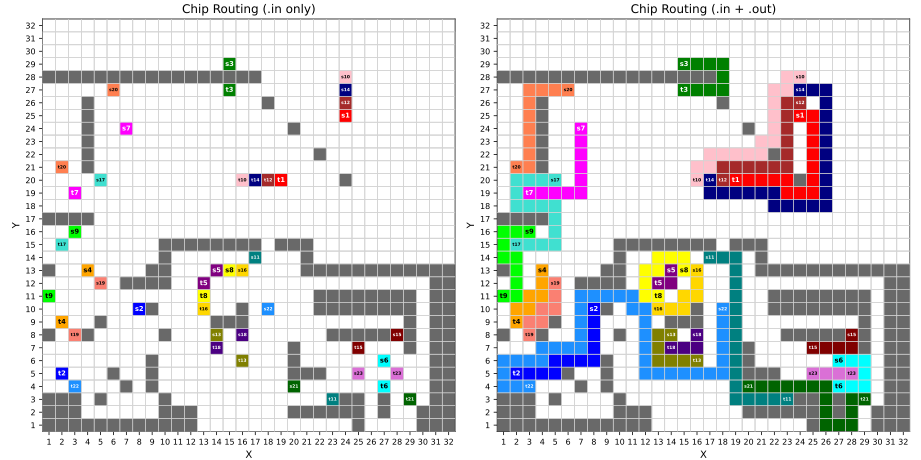

# Single Layer ChipRouter

## Features
- Implements the Lee algorithm (BFS-based) for single-layer routing; guarantees the shortest available path at the moment of routing
- Supports randomized mode with early-stop heuristics to improve runtime under tight constraints
- Provides two routing strategies: random and weighted path selection
- Clean modular structure with separate `src/`, `build/`, and `bin/` directories for organization and maintainability


## Environment:
- OS: Ubuntu 22.04
- Compiler: gcc 9.5
- C++ Standard: C++17


## Directory Structure
```
PA2/
  ├── Makefile                    // Build script to compile the project
  ├── visualizer.py               // Python script to visualize routing result
  ├── evaluator-linux-x86_64-v3   // Executable to verify output correctness
  ├── example/                    // Sample input (.in) files for quick testing or demo
  ├── testcase/                   // Official cases used for evaluation and scoring
  │
  ├── include/                    // Header files
  │   ├── router.h
  │   ├── solver.h
  │   └── types.h
  │
  ├── src/                        // C++ source files
  │   ├── main.cpp                // Main entry point
  │   ├── router.cpp              // Routing algorithm implementation
  │   └── solver.cpp              // Problem solver and result handling
  │
  ├── build/                      // Object files (.o), created after make
  ├── bin/                        // Final executable, e.g., bin/Chip_Router
  ├── run.sh                      // Shell script to run all testcases
  └── evaluator.sh                // Shell script to evaluate all results
```
## How to compile
To generate the executable `bin/Chip_Router`, simply run
```
make
```
## How to execute
Run the program with
```
./bin/Chip_Router <input.in> <output.out>
```
## How to verify
To verify the output with provided verifier
```
./evaluator-linux-x86_64-v3 <input.in> <output.out>
```
## How to plot
To visualize the result (requires Python and matplotlib)

Color-coded path visualization to inspect routing quality
```
python3 visualizer.py
```
## Utility Scripts
To solve/verify all testcase
```
./run.sh
./evaluator.sh
```
## Experiment
<p align="center">
  
</p>
<p align="center"><em>Figure 1. Routing result for <code>congestion</code></em></p>

<p align="center">
  
</p>
<p align="center"><em>Figure 2. Routing result for <code>in_turn</code></em></p>

<p align="center">
  
</p>
<p align="center"><em>Figure 3. Routing result for <code>sample</code></em></p>

<p align="center">
  
</p>
<p align="center"><em>Figure 4. Routing result for <code>shortest_path</code></em></p>

<p align="center">
  
</p>
<p align="center"><em>Figure 5. Routing result for <code>trade_off</code></em></p>

<p align="center">
  
</p>
<p align="center"><em>Figure 6. Routing result for <code>trap</code></em></p>

