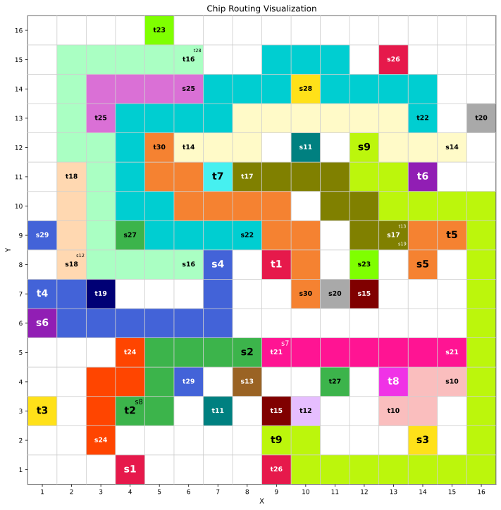
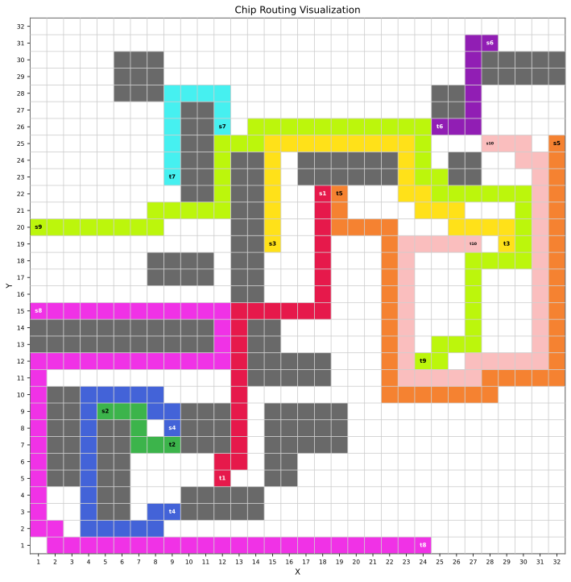
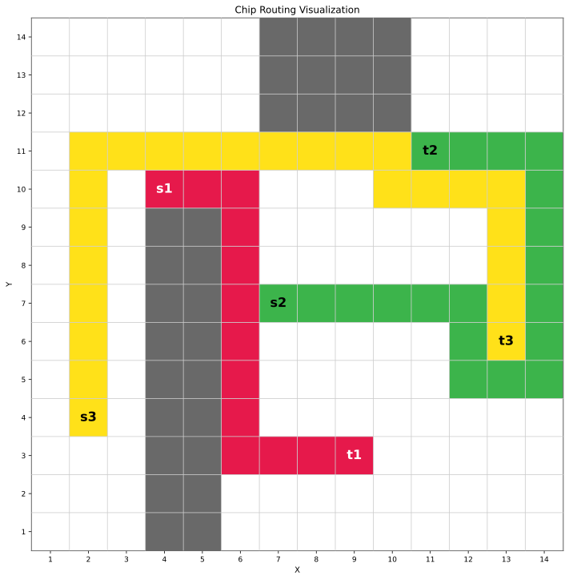
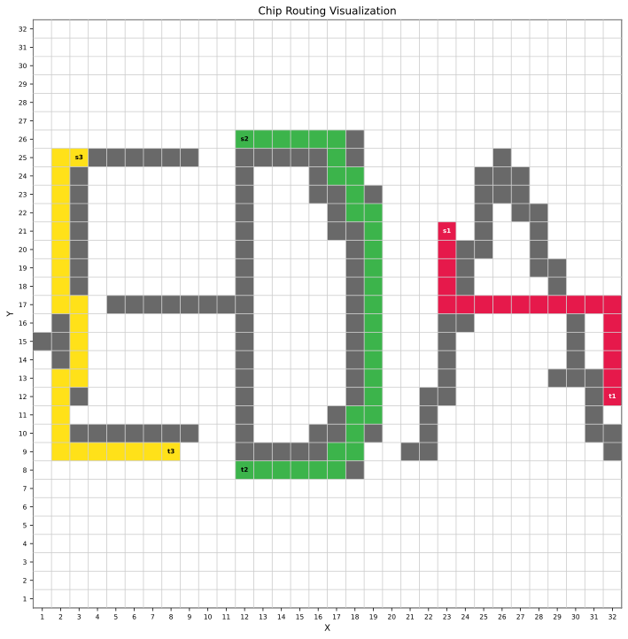
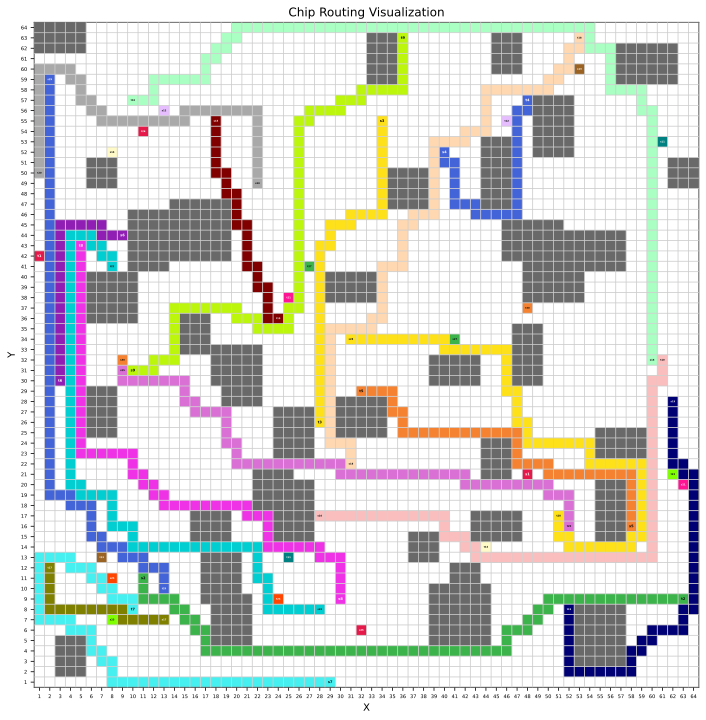
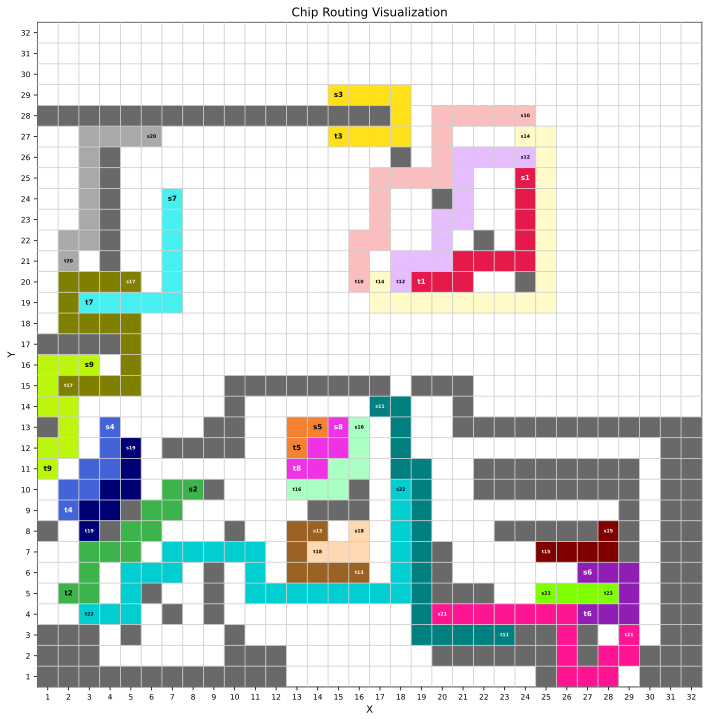

# Single Layer Chip Routing
The Chip Routing Solver is a sophisticated routing algorithm designed to solve chip interconnection problems on a 2D grid. The system implements two distinct routing strategies to optimize the placement of electrical connections while avoiding blockages and minimizing routing metrics such as total length, number of bends, and congestion.

## Problem Formulation
Given a 2D chip area with rectangular blockages and multiple interconnection pairs, the goal is to compute legal wire routes that connect each pair without crossing blockages, exceeding boundaries, or overlapping with other wires. The routing should prioritize: (1) maximizing the number of successful connections, (2) minimizing total wire length, (3) minimizing the longest wire length, and (4) minimizing total wire bends. The output lists the exact path for each routed interconnection.

## Features
- Implements the Lee algorithm (BFS-based) for single-layer routing; guarantees the shortest available path at the moment of routing
- Provides two routing strategies: random and weighted path selection
- Supports randomized mode with early-stop heuristics to improve runtime under tight constraints
- Clean modular structure with separate `src/`, `build/`, and `bin/` directories for organization and maintainability
- Comprehensive report of detailed routing statistics and path visualization

## Processing Pipeline
1. **Parse input**: Read the chip size, blockages, and interconnection pairs from a structured input file.
2. **Initialize Router**: Set up the grid, mark blockages, and reserve pins for all nets.
3. **Determine Routing Order**:
   - _Mode 0_: Randomly shuffle the net order and route repeatedly with early stopping or timeout.
   - _Mode 1_: Compute a weighted score and sort nets by difficulty, then route once.
4. **Route Nets**: Apply Lee algorithm (BFS based) to route each net sequentially while avoiding overlaps, blockages, and boundary violations.
5. **Evaluate Solution**: Count routed nets, total wire length, identify the longest route, and bend counts.
6. **Save and Report**: Output the best routing result including full paths and routing metrics.


## Parameters
- Mode (Random)  
  - Attempts: 10000  
  - Early stop (no improvement): 3000

- Mode 1 (Weighted)  
  - Score: alpha * Manhattan_distance + beta * Congestion + gamma * Edge_proximity
  - alpha = 1.5
  - beta = 1.0
  - gamma = 0.5

## Input / Output Format
## Input
**Input.in**

```
<chip_width> <chip_height>
#blockages <num_blockages>
<x1> <y1> <x2> <y2>
# repeated <num_blockages> times
...
#interconnections <num_interconnections>
<sx1> <sy1> <tx1> <ty1>
# repeated <num_interconnections> times
...
```

**Example**
```
14 14
#blockages 2
4 1 5 9
7 12 10 14
#interconnections 3
4 10 9 3
7 7 11 11
2 4 13 6
```

### Output
**Output.out**
```
#interconnections routed = <num_routed>
Total interconnection length = <total_length>
The longest interconnection = <interconnection_id>; length = <longest_length>
Total number of bends = <total_bends>
Interconnection <id1>: length = <length1>, #bends = <bends1>
(<x>, <y>), (<x>, <y>), ..., (<x>, <y>)
# repeated <num_routed> times
...
```

**Example**
```
#interconnections routed = 3
Total interconnection length = 53
The longest interconnection = 3; length = 23
Total number of bends = 11
Interconnection 1: length = 12, #bends = 3
(4, 10), (5, 10), (6, 10), (6, 9), (6, 8), (6, 7), (6, 6), (7, 6), (8, 6), (9, 6), (9, 5), (9, 4), (9, 3)
Interconnection 2: length = 18, #bends = 4
(7, 7), (8, 7), (9, 7), (10, 7), (11, 7), (12, 7), (12, 6), (12, 5), (13, 5), (14, 5), (14, 6), (14, 7), (14, 8), (14, 9), (14, 10), (14, 11), (13, 11), (12, 11), (11, 11)
Interconnection 3: length = 23, #bends = 4
(2, 4), (2, 5), (2, 6), (2, 7), (2, 8), (2, 9), (2, 10), (2, 11), (3, 11), (4, 11), (5, 11), (6, 11), (7, 11), (8, 11), (9, 11), (10, 11), (10, 10), (11, 10), (12, 10), (13, 10), (13, 9), (13, 8), (13, 7), (13, 6)
```

## Environment:
- OS: Ubuntu 22.04
- Compiler: gcc 9.5
- C++ Standard: C++17


## Directory Structure
```
PA2/
  ├── Makefile                    // Build script to compile the project
  ├── visualizer.py               // Python script to visualize routing result
  ├── evaluator-linux-x86_64-v3   // Executable to verify output correctness
  ├── example/                    // Sample input (.in) files for quick testing or demo
  ├── testcase/                   // Official cases used for evaluation and scoring
  │
  ├── include/                    // Header files
  │   ├── router.h
  │   ├── solver.h
  │   └── types.h
  │
  ├── src/                        // C++ source files
  │   ├── main.cpp                // Main entry point
  │   ├── router.cpp              // Routing algorithm implementation
  │   └── solver.cpp              // Problem solver and result handling
  │
  ├── build/                      // Object files (.o), created after make
  ├── bin/                        // Final executable, e.g., bin/Chip_Router
  ├── run.sh                      // Shell script to run all testcases
  ├── evaluator.sh                // Shell script to evaluate all results
  └── README.md
```

## Usage Guide
### How to compile
To generate the executable `bin/Chip_Router`, simply run
```
make
```
### How to execute
Run the program with
```
./bin/Chip_Router <input.in> <output.out>
```
### How to verify
To verify the output with provided verifier
```
./evaluator-linux-x86_64-v3 <input.in> <output.out>
```
### How to plot
To visualize the result (requires Python and matplotlib)

Color-coded path visualization to inspect routing quality
```
python3 visualizer.py
```
### Utility Scripts
To solve/verify all testcase
```
./run.sh
./evaluator.sh
```
## Experiment
<p align="center">
  
</p>
<p align="center">Figure 1. Routing result for <code>congestion</code></p>

<p align="center">
  
</p>
<p align="center">Figure 2. Routing result for <code>in_turn</code></p>

<p align="center">
  
</p>
<p align="center">Figure 3. Routing result for <code>sample</code></p>

<p align="center">
  
</p>
<p align="center">Figure 4. Routing result for <code>shortest_path</code></p>

<p align="center">
  
</p>
<p align="center">Figure 5. Routing result for <code>trade_off</code></p>

<p align="center">
  
</p>
<p align="center">Figure 6. Routing result for <code>trap</code></p>

